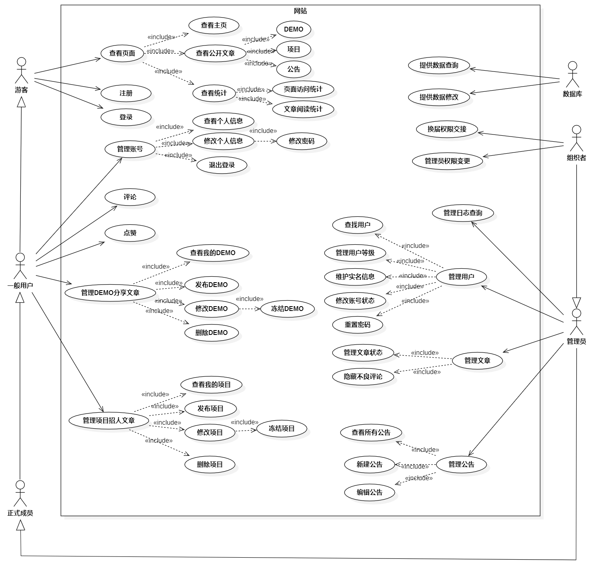

## 项目背景

哈尔滨工业大学游戏社团需要一个类似论坛的网站，用于社团成员分享自己的DEMO

## 安装

运行服务器：需要安装node.js框架、npm包管理工具、目录下指定的node包、MySQL，用node server.js启动

访问服务器：在谷歌浏览器输入我们的服务器网址即可（网址可能发生变动，社团QQ群里看辰繁的群名片即可）

## 使用

把这个东西运行起来不大方便，目前建议访问我们运行起来的网站

## Badge

暂无

## 相关项目

无

## 主要项目负责人

辰繁(abc2513)

## 参与贡献方式

1、提交issue，包括但不限于BUG、UI/配色优化建议、功能拓展建议

2、与项目负责人协商参与到开发中来

## 开源协议

MIT协议
